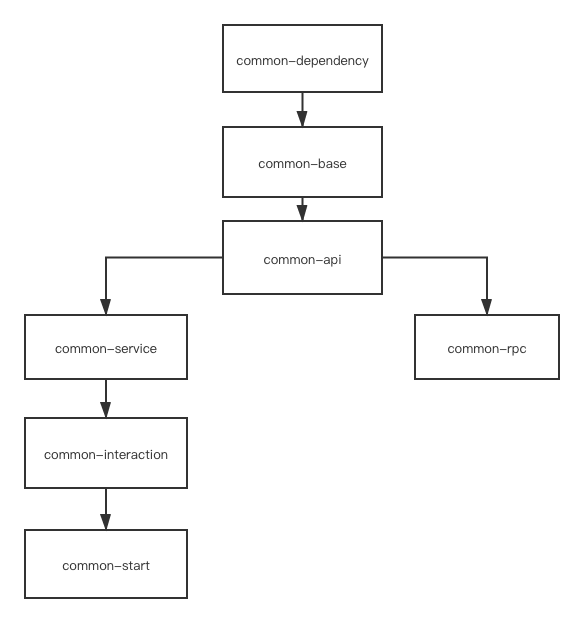

# 一.项目介绍
此项目旨在给出统一标准的业务应用开发规范与全局框架层配置。
  
## 1.1.日常开发常见问题
- 业务结构分包混乱
- 重复工具类
- VO,DTO,BO。。。傻傻分不清楚
- 通用型配置重复开发
- 异常处理不统一
- controller层返回实体不统一
- maven依赖混乱管理难
- 等等。。

## 2.1.本项目为你解决
- 业务应用分包结构划分
- 统一maven依赖管理入口
- 多环境打包支持
- 统一基础工具包
- 统一spring层框架配置
- 等等。。

# 二.使用技术
三方库/框架 | 名称
---|---
注册中心 | nacos
配置中心 | nacos
RPC框架 | OpenFeign
链路跟踪 | zipkin
本地缓存 | guava
中间件缓存 | redis
数据库连接池 | durid
数据库版本管理 | flyway
ORM框架 | mybytis-plus
接口文档 | swagger
数据库 | mysql
序列化 | gson

# 三.项目架构
## 3.1.层级依赖图

## 3.2.层级说明
### 3.2.1.common-dependency
管理整个common工程子包以及公共三方依赖版本

### 3.2.2.common-base
基础包，依赖进来统一的工具、插件，定义普遍要使用的实体对象(page等)、异常对象、结果对象等

### 3.2.3.common-api
> 此工程内无含义，为指导作用

用于远程rpc接口定义，此包内定义远程调用接口信息与需要开放给三方使用的实体与工具类信息

### 3.2.4.common-rpc
> 此工程内无含义，为指导作用

为api包的feign接口定义，包括异常回滚策略也会定义在此处。如果需要提供相应的快速启动bean也是在此包内定义

### 3.2.5.common-service
定义服务层所需要的公共依赖

### 3.2.6.common-interaction
用户交互层，主要用于定义与外部交互的类，包括但不仅限于controller,mq,rpc

### 3.2.7.common-start
整个应用启动入口，提供了nacos的关联配置，日志的相关配置，启动类注解

# 四.使用方式
## 4.1.pom管理
1.应用服务的父pom从spring-boot修改为

```
<parent>
    <groupId>com.baiyan</groupId>
    <artifactId>common</artifactId>
    <version>0.0.1-SNAPSHOT</version>
    <relativePath/>
</parent>
```

2.增加整体版本依赖管理

```
<dependencyManagement>
    <dependencies>
        <dependency>
            <groupId>com.baiyan</groupId>
            <artifactId>common-dependency</artifactId>
            <version>${project.version}</version>
            <type>pom</type>
            <scope>import</scope>
        </dependency>
    </dependencies>
</dependencyManagement>
```

## 4.2.业务包划分
业务包按照common包分包规则进行划分。

## 4.3.配置说明
- 日期时间序列化与反序列化在web与rpc传输时开关

```
common:
  config:
    jackson:
      enable: true
```


---
- swagger3.0配置

```
swagger:
  config:
    enable: true
    groupName: 分组
    basePackage: com.examp.demo.controller
    title: demo
    description: demo描述
    version: 测试版本
```

---

- 领域事件服务

```
common:
  config:
    domain:
      event:
        enable: true
```


